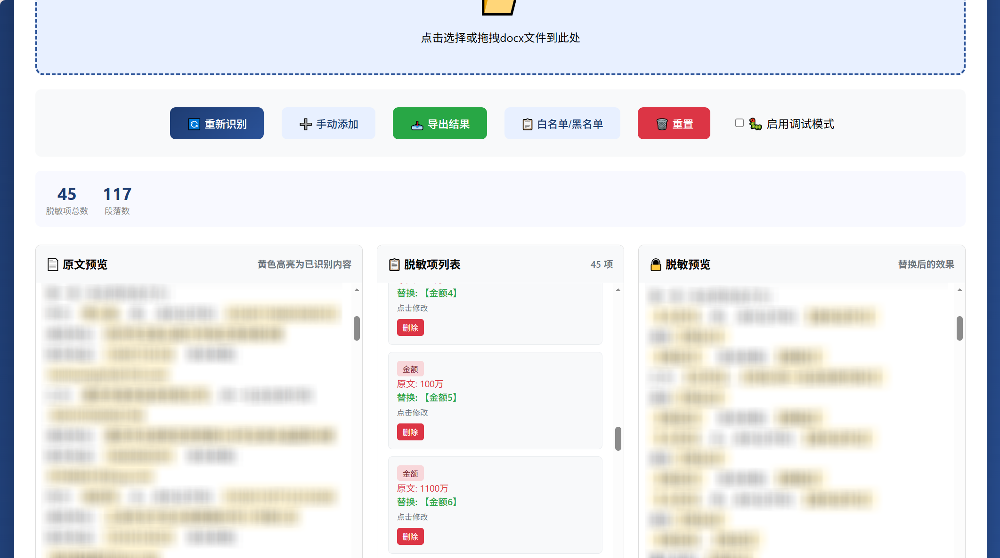
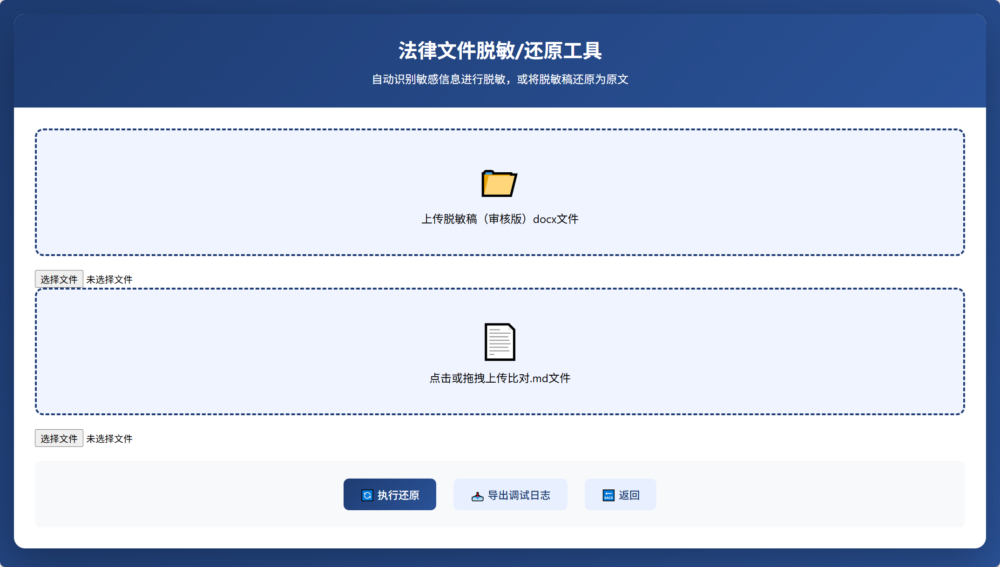
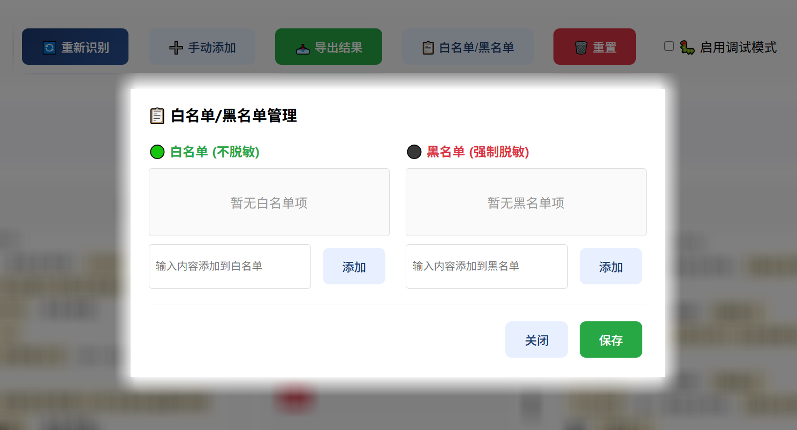

# 法律文件脱敏处理工具


一款完全离线的法律文档脱敏工具，支持脱敏和还原两大核心功能，数据不上传，安全可控。

## 核心功能

### 脱敏功能


将法律文档中的敏感信息智能识别并替换为脱敏标记，生成可对外分享的脱敏版本。

**支持的脱敏类型：**
- organization（组织机构）
- id_card（身份证号）
- date（日期）
- price（金额）
- person_name（人名）
- phone（联系电话）
- email（联系邮箱）
- credit_code（统一社会信用代码）
- bank_account（账号）
- org_code（组织机构代码）
- patent_code（专利申请号）
- file_code（文件编号）
- case_number（案号）
- project_name（项目名称）
- address（地址）

**功能特点：**
- **智能识别**：基于正则表达式自动识别15类敏感信息
- **自定义类型**：创建自定义脱敏类型（如"合同名称"、"产品型号"），批量输入精准匹配内容
- **手动编辑**：支持手动添加、删除、修改脱敏项
- **实时预览**：黄色高亮显示脱敏内容，实时查看效果
- **白名单/黑名单**：精确控制哪些内容不脱敏或强制脱敏
- **优先级机制**：黑名单（最高）> 白名单 > 脱敏类别（内置+自定义）
- **冲突检测**：添加到列表时自动检测是否已存在于其他列表
- **调试模式**：详细日志记录和导出，便于问题排查
- **格式保留**：完整保留原文档格式

### 还原功能


使用脱敏时生成的"替换比对.md"文件，将脱敏文档还原为原始状态。

**核心特点：保留修订和批注**
- **外部审核工作流**：脱敏稿可发送给外部审核，审核人员添加的修订和批注会被完整保留
- **精确还原**：还原后可查看外部审核的所有修改意见和批注
- **格式保留**：还原后的文档保持原有格式和审核痕迹

## 使用方式

### 脱敏流程

1. **打开工具**：双击 `assets/index.html`

2. **上传文件**：点击上传区域或拖拽 docx 文件

3. **查看识别结果**：
   - 自动识别的敏感信息会以黄色高亮显示
   - 左侧显示脱敏项列表

4. **编辑脱敏项**（可选）：
   - **添加**：点击"手动添加"或直接在原文中选中文本
   - **删除**：在脱敏项列表中点击"删除"
   - **修改**：点击脱敏项进行编辑



5. **白名单/黑名单/自定义类型管理**（可选）：
   - 点击对应按钮打开管理面板
   - **白名单**：添加不希望脱敏的内容（如公开公司名），会阻止包含该内容的识别
   - **黑名单**：添加强制脱敏的内容，优先级最高
   - **自定义类型**：创建新的脱敏类型（如"合同名称"），批量添加匹配内容
   - **优先级规则**：黑名单 > 白名单 > 脱敏类别


6. **启用调试模式**（可选）：
   - 勾选"启用调试模式"
   - 查看详细的识别和处理日志
   - 点击"导出日志"下载调试日志

7. **导出结果**：
   - 点击"导出结果"
   - 选择导出内容（默认全选）：
     - 脱敏文件.docx
     - 替换比对.md（用于还原）
   - 点击"导出"

### 还原流程

**典型场景：外部审核**
1. 脱敏原始文档 → 发送外部审核
2. 外部审核人员在脱敏稿上添加修订和批注
3. 还原功能保留所有审核痕迹，还原为原始内容
4. 内部人员可查看外部审核意见

**操作步骤：**
1. **切换到还原模式**：
   - 点击顶部"切换到还原模式"链接

2. **上传文件**：
   - 上传脱敏后的 docx 文件
   - 上传对应的"替换比对.md"文件

3. **执行还原**：
   - 点击"执行还原"
   - 系统会根据替换记录还原原文

4. **导出还原文件**：
   - 点击"导出还原后的docx"

## 项目结构

```
法律文件脱敏处理/
├── SKILL.md                  # 技能定义
├── README.md                 # 项目说明（本文件）
├── LICENSE                   # MIT License
├── references/               # 详细参考文档
│   ├── workflow.md           # 工作流程
│   ├── patterns.md           # 规则模式库
│   └── data-formats.md       # 数据格式说明
├── scripts/                  # Python脚本（可选）
│   ├── README.md             # 脚本使用说明
│   ├── requirements.txt      # 依赖列表
│   ├── redact.py             # 脱敏脚本
│   └── restore.py            # 还原脚本
└── assets/                   # HTML离线工具（主要）
    ├── README.md             # HTML使用说明
    └── index.html            # 主程序（完全离线）
```

## 导出文件说明

### 1. 脱敏文件.docx

保留原格式的脱敏文档，可直接对外分享。

### 2. 替换比对.md

记录所有脱敏操作的明细，包含：
- 原文内容
- 替换内容
- 脱敏类型
- 位置信息

**用途：**
- 还原脱敏文档的必要文件
- 脱敏操作的审计记录

## 技术栈

- **前端**：HTML + CSS + JavaScript（mammoth.js、JSZip）
- **后端**：Python 3.7+（可选，用于高级功能）

## 注意事项

1. **完全离线**：所有功能在浏览器本地执行，数据不上传
2. **备份文件**：处理前建议备份原始文件
3. **保存比对文件**：替换比对.md是还原的必要条件，请妥善保存
4. **浏览器兼容**：推荐使用 Chrome、Edge 等现代浏览器

## 许可证

MIT License - 详见 [LICENSE](LICENSE)

## 版本

v1.3.0
