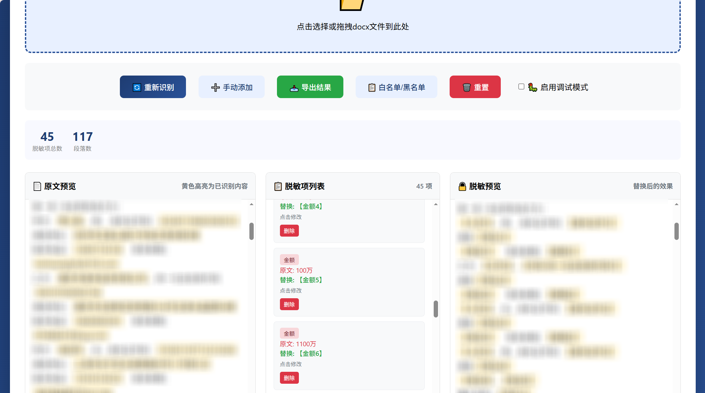
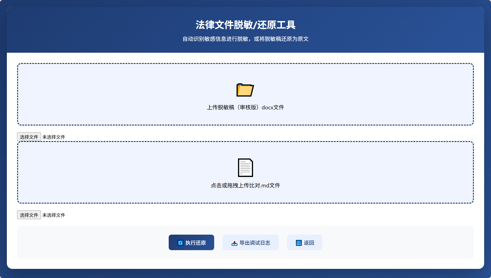
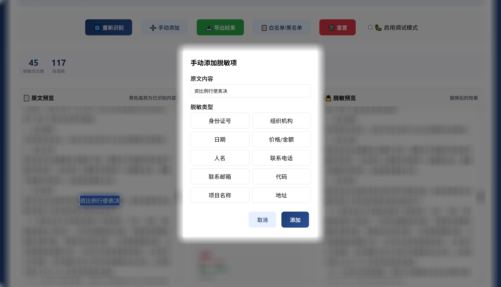

# 法律文件脱敏处理工具


一款完全离线的法律文档脱敏工具，支持脱敏和还原两大核心功能，数据不上传，安全可控。

> **⚠️ Mac用户注意**：Safari 浏览器下载 zip 包可能会出错，建议使用 Chrome 或其他浏览器下载。

## 核心功能

### 脱敏功能


将法律文档中的敏感信息智能识别并替换为脱敏标记，生成可对外分享的脱敏版本。

**支持的脱敏类型：**
- organization（组织机构）
- id_card（身份证号）
- date（日期）
- price（金额）
- person_name（人名）
- phone（联系电话）
- email（联系邮箱）
- credit_code（统一社会信用代码）
- bank_account（账号）
- org_code（组织机构代码）
- patent_code（专利申请号）
- file_code（文件编号）
- case_number（案号）
- project_name（项目名称）
- address（地址）

**功能特点：**
- **智能识别**：基于正则表达式自动识别15类敏感信息
- **批量模式**：上传多个文件自动进入批量模式，统一编号确保相同内容使用相同替换文本
- **独立比对文件**：批量导出时每个文件生成独立的 `{文件名}_比对.md`
- **自定义类型**：创建自定义脱敏类型（如"合同名称"、"产品型号"），批量输入精准匹配内容
- **导入词库**：从Excel批量导入敏感词库和白名单，支持团队共享词库
- **导出词库**：导出白名单和敏感词库为Excel，文件名包含日期，方便版本管理
- **手动编辑**：支持手动添加、删除、修改脱敏项
- **实时预览**：黄色高亮显示脱敏内容，实时查看效果
- **白名单/黑名单**：精确控制哪些内容不脱敏或强制脱敏
- **优先级机制**：黑名单（最高）> 白名单 > 脱敏类别（内置+自定义）
- **冲突检测**：添加到列表时自动检测是否已存在于其他列表
- **调试模式**：详细日志记录和导出，便于问题排查
- **规则设置**：可自主开启/关闭内置脱敏类别，灵活控制识别范围
- **格式保留**：完整保留原文档格式

### 还原功能


使用脱敏时生成的"替换比对.md"文件，将脱敏文档还原为原始状态。

**核心特点：保留修订和批注**
- **外部审核工作流**：脱敏稿可发送给外部审核，审核人员添加的修订和批注会被完整保留
- **精确还原**：还原后可查看外部审核的所有修改意见和批注
- **格式保留**：还原后的文档保持原有格式和审核痕迹

## 使用方式

### 脱敏流程

**单文件脱敏：**
1. **打开工具**：双击 `assets/index.html`
2. **上传文件**：点击上传区域或拖拽单个 docx 文件
3. **查看识别结果**：自动识别敏感信息，黄色高亮显示
4. **编辑脱敏项**（可选）：手动添加/删除/修改脱敏项
5. **管理列表**（可选）：白名单/黑名单/自定义类型管理
6. **规则设置**（可选）：开启/关闭内置脱敏类别
7. **导出结果**：导出脱敏文件.docx 和 替换比对.md

**批量脱敏（上传多个文件自动触发）：**
1. **上传多个文件**：拖拽或选择多个 docx 文件
2. **统一识别**：相同内容在不同文件中使用相同替换文本（如"张三"在所有文件中都替换为"人名1"）
3. **文件切换**：通过顶部文件标签栏切换查看各文件的识别结果
4. **同步编辑**：在任一文件中删除/添加脱敏项，会同步到其他文件
5. **导出结果**：
   - ZIP打包下载
   - 每个文件生成独立的 `{文件名}_比对.md`
   - 比对文件存放在 `比对文件/` 文件夹中


**白名单/黑名单/自定义类型管理**（可选）：
- 点击对应按钮打开管理面板
- **白名单**：添加不希望脱敏的内容（如公开公司名），会阻止包含该内容的识别
- **黑名单**：添加强制脱敏的内容，优先级最高
- **自定义类型**：创建新的脱敏类型（如"合同名称"），批量添加匹配内容
- **优先级规则**：黑名单 > 白名单 > 脱敏类别



**规则设置**（可选）：
- 点击"⚙️ 规则设置"按钮打开设置面板
- **开启/关闭类别**：勾选或取消勾选内置脱敏类别
- **代码类分组联动**：4个代码子类（统一社会信用代码、组织机构代码、专利申请号、文件编号）任一启用，"代码"按钮就可用
- **快捷操作**：提供"全选"/"全不选"按钮
- **设置持久化**：保存在浏览器本地，刷新页面后保持
- **类型选择器联动**：禁用的类别在手动添加脱敏项时变灰不可选

**导入词库**（可选）：
- 点击"导入词库"按钮
- **导入敏感词库**：Excel格式（敏感词 | 类型），自动识别内置类型和自定义类型
- **导入白名单**：Excel格式（内容），批量添加白名单
- 支持团队共享词库，方便统一管理

**启用调试模式**（可选）：
- 勾选"启用调试模式"
- 查看详细的识别和处理日志
- 点击"导出日志"下载调试日志

### 还原流程

**典型场景：外部审核**
1. 脱敏原始文档 → 发送外部审核
2. 外部审核人员在脱敏稿上添加修订和批注
3. 还原功能保留所有审核痕迹，还原为原始内容
4. 内部人员可查看外部审核意见

**单文件还原：**
1. **切换到还原模式**：点击顶部"切换到还原模式"链接
2. **上传文件**：上传脱敏后的 docx 文件 + 对应的"替换比对.md"文件
3. **执行还原**：点击"执行还原"
4. **导出文件**：点击"导出还原后的docx"

**批量还原（4步流程）：**
1. **上传文件**：
   - 上传多个脱敏稿 docx 文件
   - 上传多个对应的比对.md 文件
2. **确认配对**：
   - 系统自动匹配文件名（如 `合同A【脱敏】.docx` ↔ `合同A_比对.md`）
   - 支持手动调整配对关系
3. **执行还原**：
   - 点击"确认并执行还原"
   - 显示进度条
4. **下载结果**：
   - ZIP打包下载所有还原后的文件

## 项目结构

```
法律文件脱敏处理/
├── SKILL.md                  # 技能定义
├── README.md                 # 项目说明（本文件）
├── LICENSE                   # MIT License
├── references/               # 详细参考文档
│   ├── workflow.md           # 工作流程
│   ├── patterns.md           # 规则模式库
│   └── data-formats.md       # 数据格式说明
├── scripts/                  # Python脚本（可选）
│   ├── README.md             # 脚本使用说明
│   ├── requirements.txt      # 依赖列表
│   ├── redact.py             # 脱敏脚本
│   └── restore.py            # 还原脚本
└── assets/                   # HTML离线工具（主要）
    ├── README.md             # HTML使用说明
    └── index.html            # 主程序（完全离线）
```

## 导出文件说明

### 1. 脱敏文件.docx

保留原格式的脱敏文档，可直接对外分享。

### 2. 替换比对.md

记录所有脱敏操作的明细，用于还原脱敏文档。
- **批量模式**：每个文件生成独立的 `{文件名}_比对.md`
- **一致性保证**：相同内容在不同文件中使用相同替换文本

### 3. 白名单.xlsx

导出白名单内容，文件名包含日期（如：白名单_2026-02-28.xlsx），可导入到其他电脑使用。

### 4. 敏感词库.xlsx

导出黑名单+自定义类型，类型显示中文，文件名包含日期，可导入到其他电脑使用。

## 技术栈

- **前端**：HTML + CSS + JavaScript（mammoth.js、JSZip）
- **后端**：Python 3.7+（可选，用于高级功能）

## 注意事项

1. **完全离线**：所有功能在浏览器本地执行，数据不上传
2. **备份文件**：处理前建议备份原始文件
3. **保存比对文件**：替换比对.md是还原的必要条件，请妥善保存
4. **浏览器兼容**：推荐使用 Chrome、Edge 等现代浏览器

## 许可证

MIT License - 详见 [LICENSE](LICENSE)

## 版本历史

- **v1.4.0** 批量模式优化：独立比对文件、修复多项批量模式bug
- **v1.3.1** 规则开关控制：可自主关闭某些内置脱敏类别
- **v1.3.0** 导入导出词库：导入敏感词库、导入白名单、导出白名单、导出敏感词库
- **v1.2.0** 优先级机制与自定义类型
- **v1.1.0** 黑名单增强
- **v1.0.0** 初始版本

详细版本历史见 [SKILL.md](SKILL.md)
